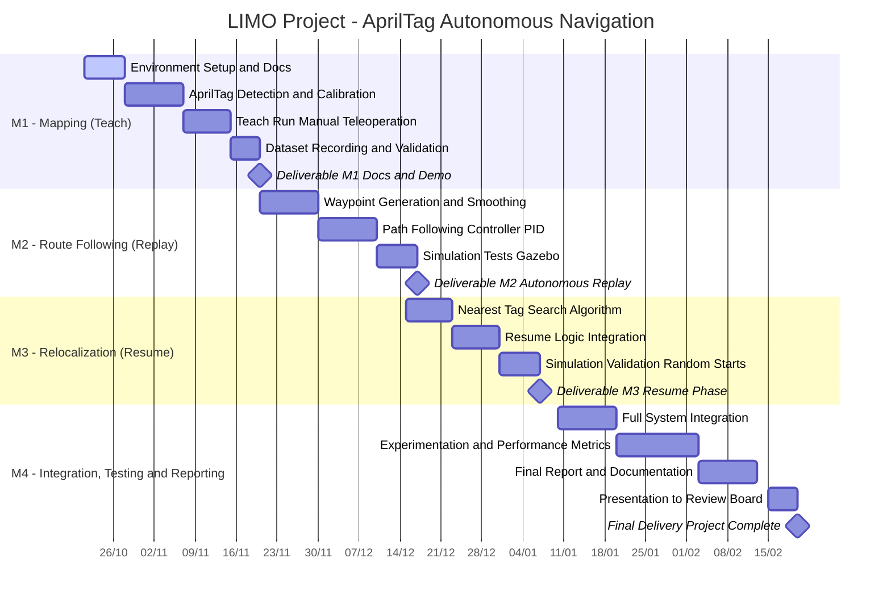

# project Gantt chart --- LIMO AprilTag Autonomous Navigation

```mermaid
gantt
    title LIMO Project - AprilTag Autonomous Navigation
    dateFormat YYYY-MM-DD
    axisFormat %d/%m
    tickInterval 1week
    todayMarker 2025-10-21

    section M1 - Mapping (Teach)
    Environment Setup and Docs :active, a1, 2025-10-21, 7d
    AprilTag Detection and Calibration :a2, after a1, 10d
    Teach Run Manual Teleoperation :a3, after a2, 8d
    Dataset Recording and Validation :a4, after a3, 5d
    Deliverable M1 Docs and Demo :milestone, m1d, after a4, 0d

    section M2 - Route Following (Replay)
    Waypoint Generation and Smoothing :b1, 2025-11-20, 10d
    Path Following Controller PID :b2, after b1, 10d
    Simulation Tests Gazebo :b3, after b2, 7d
    Deliverable M2 Autonomous Replay :milestone, m2d, after b3, 0d

    section M3 - Relocalization (Resume)
    Nearest Tag Search Algorithm :c1, 2025-12-15, 8d
    Resume Logic Integration :c2, after c1, 8d
    Simulation Validation Random Starts :c3, after c2, 7d
    Deliverable M3 Resume Phase :milestone, m3d, after c3, 0d

    section M4 - Integration, Testing and Reporting
    Full System Integration :d1, 2026-01-10, 10d
    Experimentation and Performance Metrics :d2, after d1, 14d
    Final Report and Documentation :d3, after d2, 10d
    Presentation to Review Board :d4, 2026-02-15, 5d
    Final Delivery Project Complete :milestone, m4d, after d4, 0d
```

